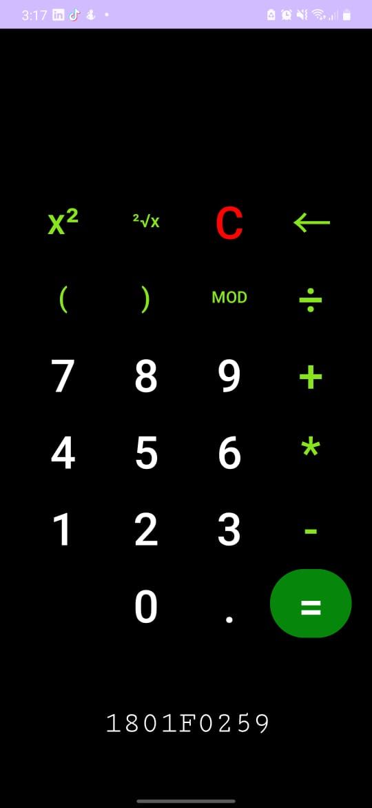

[ENGLISH](#english)
[ESPAÑOL](#español)

### ENGLISH
# Calculator

## Description
This Android calculator app is a mobile application that allows you to perform a wide variety of mathematical calculations directly on your Android device. It was developed from scratch in Android Studio, 
without the use of external libraries, to provide a fast and efficient calculation experience.

## Main Functions:

Performs basic mathematical operations such as addition, subtraction, multiplication, and division.
Executes advanced calculations, including operations with decimal numbers and powers.
Intuitive and user-friendly user interface.
Accurate and fast results.

## Capturas de Pantalla

_(Agrega aquí las capturas de pantalla de tu aplicación si es necesario)_

## Instalación
1. Descarga el archivo APK de la aplicación desde [enlace a tu archivo APK] o clona este repositorio.
2. Instala el archivo APK en tu dispositivo Android.
3. ¡Listo! Ahora puedes utilizar la Calculadora Android en tu dispositivo.

## Uso
- Abre la aplicación Calculadora Android en tu dispositivo.
- Toca los números y operadores en la pantalla para realizar tus cálculos.
- El resultado se mostrará en la parte superior de la pantalla.

## Contribución
Si deseas contribuir a este proyecto, ¡eres bienvenido! Puedes enviar sugerencias, informar problemas o enviar solicitudes de extracción. Asegúrate de seguir las mejores prácticas de desarrollo y respetar las pautas de contribución.

## Licencia
Este proyecto está bajo la Licencia [Nombre de la Licencia]. Puedes consultar el archivo [LICENSE](LICENSE) para obtener más detalles.

## Contacto
Si tienes alguna pregunta o comentario sobre la Calculadora Android, no dudes en ponerte en contacto conmigo en [tu dirección de correo electrónico] o [tu cuenta de GitHub].

### ESPAÑOL
# Calculadora

## Description
This Android calculator app is a mobile application that allows you to perform a wide variety of mathematical calculations directly on your Android device. It was developed from scratch in Android Studio, 
without the use of external libraries, to provide a fast and efficient calculation experience.
## Características Principales
- Realiza operaciones matemáticas básicas, como suma, resta, multiplicación y división.
- Ejecuta cálculos avanzados, como operaciones con números decimales y potencias.
- Interfaz de usuario intuitiva y fácil de usar.
- Resultados precisos y rápidos.

## Capturas de Pantalla

_(Agrega aquí las capturas de pantalla de tu aplicación si es necesario)_

## Instalación
1. Descarga el archivo APK de la aplicación desde [enlace a tu archivo APK] o clona este repositorio.
2. Instala el archivo APK en tu dispositivo Android.
3. ¡Listo! Ahora puedes utilizar la Calculadora Android en tu dispositivo.

## Uso
- Abre la aplicación Calculadora Android en tu dispositivo.
- Toca los números y operadores en la pantalla para realizar tus cálculos.
- El resultado se mostrará en la parte superior de la pantalla.

## Contribución
Si deseas contribuir a este proyecto, ¡eres bienvenido! Puedes enviar sugerencias, informar problemas o enviar solicitudes de extracción. Asegúrate de seguir las mejores prácticas de desarrollo y respetar las pautas de contribución.

## Licencia
Este proyecto está bajo la Licencia [Nombre de la Licencia]. Puedes consultar el archivo [LICENSE](LICENSE) para obtener más detalles.

## Contacto
Si tienes alguna pregunta o comentario sobre la Calculadora Android, no dudes en ponerte en contacto conmigo en [tu dirección de correo electrónico] o [tu cuenta de GitHub].

¡Gracias por usar la Calculadora Android!
