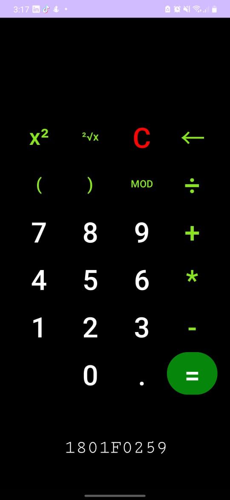

[ENGLISH](#english)
[ESPAÑOL](#español)

### ENGLISH
# Calculator

## Description
This Android calculator app is a mobile application that allows you to perform a wide variety of mathematical calculations directly on your Android device. It was developed from scratch in Android Studio, 
without the use of external libraries, to provide a fast and efficient calculation experience.

## Main Functions:
Performs basic mathematical operations such as addition, subtraction, multiplication, and division.
Executes advanced calculations, including operations with decimal numbers and powers.
Intuitive and user-friendly user interface.
Accurate and fast results.

## Screenshots

## Instalation
1. Clone this repository.
2. Install the APK file on your Android device.
3. Ready! Now you can use the Calculator in your device. 

## Use
- Open the Calculator app on your device.
- Tap the numbers and operators on the screen to perform your calculations.
- The result will be displayed at the top of the screen.

## Contribution
If you wish to contribute to this project, you are welcome! You can send suggestions, report problems, or submit pull requests. Make sure to follow the best development practices and respect the contribution guidelines.

## Contact
If you have any questions or comments about the Calculator, please feel free to contact me at [vguzmanloredo@gmail.com] or through my GitHub account.### ESPAÑOL

### ESPAÑOL
# Calculadora

## Description
This Android calculator app is a mobile application that allows you to perform a wide variety of mathematical calculations directly on your Android device. It was developed from scratch in Android Studio, 
without the use of external libraries, to provide a fast and efficient calculation experience.
## Características Principales
- Realiza operaciones matemáticas básicas, como suma, resta, multiplicación y división.
- Ejecuta cálculos avanzados, como operaciones con números decimales y potencias.
- Interfaz de usuario intuitiva y fácil de usar.
- Resultados precisos y rápidos.

## Capturas de Pantalla

## Instalación
1. Clona este repositorio.
2. Instala el archivo APK en tu dispositivo Android.
3. ¡Listo! Ahora puedes utilizar la Calculadora Android en tu dispositivo.

## Uso
- Abre la aplicación Calculadora Android en tu dispositivo.
- Toca los números y operadores en la pantalla para realizar tus cálculos.
- El resultado se mostrará en la parte superior de la pantalla.

## Contribución
Si deseas contribuir a este proyecto, ¡eres bienvenido! Puedes enviar sugerencias, informar problemas o enviar solicitudes de extracción. Asegúrate de seguir las mejores prácticas de desarrollo y respetar las pautas de contribución.

## Contacto
Si tienes alguna pregunta o comentario sobre la Calculadora Android, no dudes en ponerte en contacto conmigo en [vguzmanloredo@gmail.com] o en mi cuenta de GitHub.

¡Gracias por usar la Calculadora Android!
